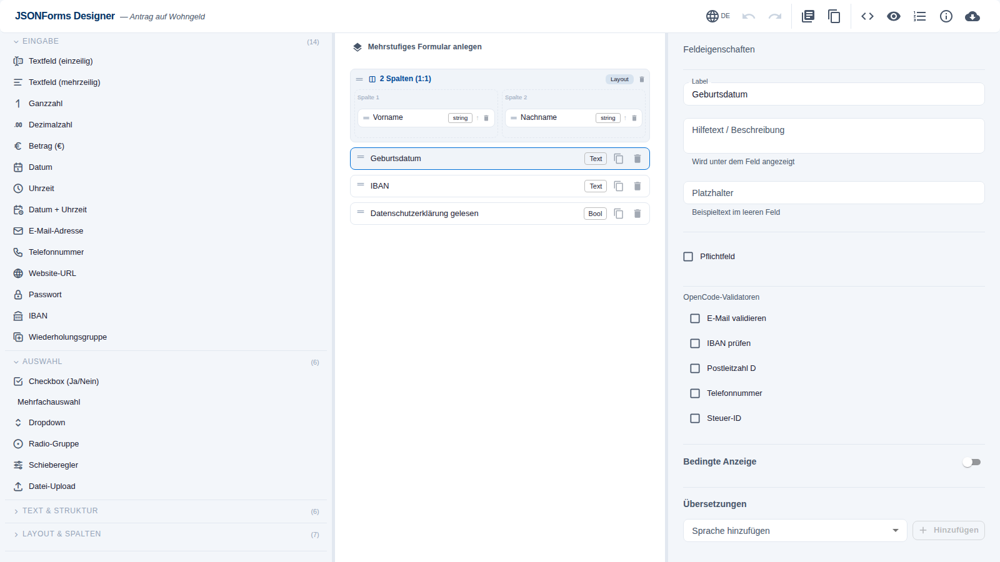
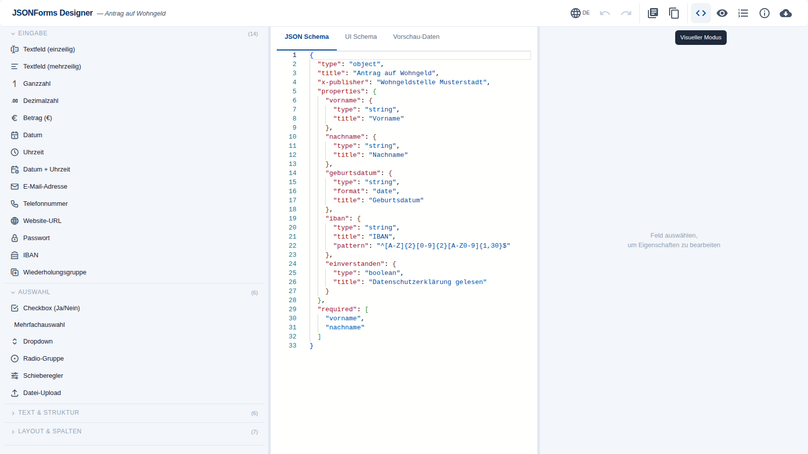
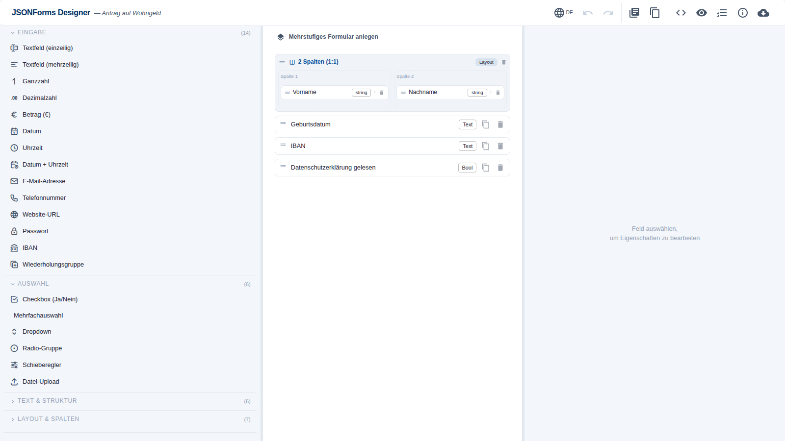

<div align="center">

# JSONForms Designer

**Visueller Formular-Editor für JSON Schema & JSONForms UI Schema**

[](./LICENSE)
[](./packages/editor/package.json)
[](./CHANGELOG.md)
[](https://react.dev)
[](https://www.typescriptlang.org)
[](https://mui.com)

*JSONForms-kompatible Formulare werden ohne Schema-Vorkenntnisse per Drag & Drop erstellt und bearbeitet.*

</div>

---

<div align="center">
  
  <br/><br/>
  
</div>

---

## Überblick

JSONForms Designer ist ein React-basierter Formular-Editor, der nach dem **Form-First-Prinzip** arbeitet: Felder werden visuell zusammengestellt, JSON Schema und UI Schema werden automatisch erzeugt. Der Editor wird als npm-Paket `@jsonforms-designer/editor` in bestehende Anwendungen eingebettet und ist für den Einsatz in deutschen Behörden und E-Government-Projekten ausgelegt.

### Funktionsübersicht

| Bereich | Funktionen |
|---|---|
| **Formular-Design** | Drag & Drop aus Palette, 30+ Feldtypen inkl. Wiederholungsgruppen, Spalten-Layouts (2/3/4-spaltig, freie Breiten), mehrstufige Formulare (Tabs) |
| **Struktur-Elemente** | Abschnittsköpfe (farbig konfigurierbar), Hinweistexte, Annotationen, benannte Gruppen |
| **Feldeigenschaften** | Label, Hilfetext, Platzhalter, Pflichtfeld, Enum-Optionen, OpenCode-Validatoren |
| **Bedingte Anzeige** | JSONForms-native `rule`-Unterstützung: Felder werden abhängig von anderen Feldwerten angezeigt, ausgeblendet oder deaktiviert |
| **Formular-Metadaten** | Titel, Behörde, Rechtsgrundlage, Versionsnummer, Gültigkeitsdatum |
| **Mehrsprachigkeit (Inhalt)** | Feldbezeichnungen, Hilfetexte und Platzhalter werden pro Sprache (EN/FR/PL/TR/AR/UK) hinterlegt |
| **Modi** | Visuell · Code (Monaco) · Vorschau — alle bidirektional synchronisiert |
| **Persistenz** | Auto-Save in `localStorage`, Export/Import als JSON, XDatenfelder-Export (XDF 2.0), Undo/Redo (50 Schritte) |
| **Druckansicht** | Print-CSS-Integration, Drucken-Button in der Vorschau-Toolbar |
| **Vorlagen** | Vorgefertigte Formular-Vorlagen |
| **Editor-Sprache** | DE / EN, per Klick umschaltbar |
| **Barrierefreiheit** | Skip-Link, ARIA-Attribute, Keyboard-Navigation, `focus-visible`-Outline (WCAG 2.4.11), `lang`-Attribut |
| **Responsivität** | Desktop 3-Spalten, Tablet/Mobile Tab-Layout |

---

## E-Government / Behördenumfeld

Der Editor ist auf die Anforderungen des deutschen E-Government ausgerichtet:

| Anforderung | Umsetzung |
|---|---|
| **FIM-Bausteine (FitKo)** | Datenfelder und Datenfeldgruppen werden direkt aus dem FIM-Portal (`fimportal.de/api/v1`) geladen und per Drag & Drop übernommen |
| **XDatenfelder-Export (XDF 2.0)** | Formulare werden als XDF-2.0-konforme XML-Datei exportiert — kompatibel mit FIM-Portal-Systemen |
| **Formular-Metadaten** | Behörde, Rechtsgrundlage und OZG-Leistungs-ID werden im Schema gespeichert (`x-publisher`, `x-legal-basis`) |
| **OpenCode-Integration** | Validatoren und UI-Bausteine aus dem OpenCode-Ökosystem werden über ein austauschbares Service-Interface angebunden |
| **Bedingte Felder** | Feldanzeige wird regelbasiert gesteuert (JSONForms `rule`-Standard) |
| **WCAG 2.1 / BITV 2.0** | Grundlegende Barrierefreiheitsanforderungen sind implementiert; eine vollständige BITV-Prüfung wird projektspezifisch empfohlen |
| **Mehrsprachige Formulare** | Übersetzungen für Feldbezeichnungen und Hilfetexte werden feldweise hinterlegt |

> **CORS-Hinweis (FIM-Portal):** Der Browser-Aufruf von `fimportal.de/api/v1` setzt voraus, dass die FIM-Portal-API CORS-Header für die Ziel-Domain setzt. Alternativ wird ein serverseitiger Proxy empfohlen (z. B. Nginx `proxy_pass`, Vite `server.proxy`).

---

## FIM-Bausteine

<div align="center">
  
</div>

Datenfelder und Datenfeldgruppen aus dem **Föderalen Informationsmanagement** werden über den `FimService` bereitgestellt und in der linken Palette angezeigt.

**Browse-Modus** (kein Suchbegriff): Datenfeldgruppen werden als ziehbare Karten dargestellt, die eine Feldvorschau enthalten.

**Such-Modus** (ab 2 Zeichen): Gruppen und Einzelfelder werden getrennt aufgeführt. Bei Verwendung des `FimApiService` erfolgt die Suche serverseitig gegen `fimportal.de/api/v1`.

Beim Ablegen einer **Datenfeldgruppe** wird ein benannter `GroupContainer` mit vorausgefüllten Feldern erzeugt. Beim Ablegen eines **Datenfelds** wird ein einzelnes Schema-Property angelegt. FIM-Identifier (`x-fim-id`) werden im Schema erhalten und stehen im XDF-Export zur Verfügung.

---

## OpenCode-Integration

Validatoren und UI-Bausteine aus dem OpenCode-Ökosystem werden per Drag aus der Palette auf Felder angewendet. Die Anbindung erfolgt über das austauschbare `OpenCodeService`-Interface — im Entwicklungsmodus ist ein Mock-Provider aktiv.

---

## Konfiguration

Alle Module werden über den `config`-Prop am `<JsonFormsEditor>`-Component konfiguriert. Die Standardkonfiguration aktiviert alle Module mit Mock-Providern.

### Vollständige Konfigurationsreferenz

```ts
import {
  JsonFormsEditor,
  FimApiService,
  EditorConfig,
} from '@jsonforms-designer/editor';

const config: EditorConfig = {
  modules: {
    fim: {
      enabled: true,

      // Produktion: FIM-Portal direkt anbinden
      service: new FimApiService({
        baseUrl: 'https://fimportal.de/api/v1', // Default
        searchParam: 'name',                    // Default
        pageSize: 100,                          // Default
        headers: {
          // Authorization: 'Bearer <token>',  // falls erforderlich
        },
        // Eigener Normalisierer für abweichende API-Formate:
        // normalizeDatenfeld: (raw) => ({ ... }),
        // normalizeDatenfeldgruppe: (raw) => ({ ... }),
      }),

      // Entwicklung: vorbereiteter vorkonfigurierter Service
      // service: fimPortalService,
    },

    openCode: {
      enabled: true,
      // service: new MyOpenCodeService(),  // eigene Implementierung
    },
  },

  palette: {
    // Gruppen, die initial zugeklappt dargestellt werden:
    collapsedByDefault: ['struktur', 'layout'],
  },
};

function MyApp() {
  return <JsonFormsEditor config={config} />;
}
```

### Konfigurationsparameter

| Parameter | Typ | Default | Beschreibung |
|---|---|---|---|
| `modules.fim.enabled` | `boolean` | `true` | FIM-Sektion in der Palette aktivieren |
| `modules.fim.service` | `FimService` | `MockFimService` | Service-Implementierung für FIM-Daten |
| `modules.openCode.enabled` | `boolean` | `true` | OpenCode-Sektion in der Palette aktivieren |
| `modules.openCode.service` | `OpenCodeService` | `MockOpenCodeService` | Service-Implementierung für OpenCode-Daten |
| `palette.collapsedByDefault` | `FieldGroup[]` | `['struktur', 'layout']` | Feldtyp-Gruppen, die initial zugeklappt sind |

### FimApiService-Parameter

| Parameter | Typ | Default | Beschreibung |
|---|---|---|---|
| `baseUrl` | `string` | `'https://fimportal.de/api/v1'` | Basis-URL der FIM-API |
| `searchParam` | `string` | `'name'` | Query-Parameter für die Textsuche |
| `pageSize` | `number` | `100` | Maximale Anzahl Ergebnisse pro Request |
| `headers` | `Record<string, string>` | `{}` | Zusätzliche HTTP-Header (z. B. Authorization) |
| `endpoints.datenfelder` | `string` | `'/fields'` | Pfad für Datenfelder |
| `endpoints.datenfeldgruppen` | `string` | `'/groups'` | Pfad für Datenfeldgruppen |
| `normalizeDatenfeld` | `(raw) => FimDatenfeld` | interner Mapper | Response-Normalisierer für abweichende API-Formate |
| `normalizeDatenfeldgruppe` | `(raw) => FimDatenfeldgruppe` | interner Mapper | Response-Normalisierer für abweichende API-Formate |

---

## Formular-Metadaten

Metadaten werden über den **ⓘ-Button** in der Toolbar erfasst und im JSON Schema als standardkonforme bzw. `x-*`-Felder gespeichert:

| Dialog-Feld | Schema-Eigenschaft | Standard |
|---|---|---|
| Formular-Titel | `schema.title` | JSON Schema |
| Beschreibung | `schema.description` | JSON Schema |
| Herausgebende Behörde | `schema.x-publisher` | Erweiterung |
| Rechtsgrundlage / OZG-ID | `schema.x-legal-basis` | Erweiterung |
| Versionsnummer | `schema.x-version` | Erweiterung |
| Gültig ab | `schema.x-valid-from` | Erweiterung |

Der Formular-Titel wird nach dem Setzen in der Header-Zeile des Editors eingeblendet.

---

## Bedingte Anzeige

Die Sichtbarkeit und Interaktivität von Feldern wird im Properties-Panel unter **Bedingte Anzeige** konfiguriert. Es wird ein JSONForms-nativer `rule`-Eintrag im UI Schema erzeugt.

```json
{
  "type": "Control",
  "scope": "#/properties/steuerIdNummer",
  "rule": {
    "effect": "SHOW",
    "condition": {
      "scope": "#/properties/staatsangehoerigkeit",
      "schema": { "const": "DE" }
    }
  }
}
```

Unterstützte Effekte: `SHOW` · `HIDE` · `DISABLE`

---

## XDatenfelder-Export

Formulare werden über den Export-Dialog (Tab **XDF 2.0**) als XDatenfelder-2.0-konforme XML-Datei exportiert. Die generierte Datei enthält:

- Alle Datenfelder mit Bezeichnung, Datentyp, Einschränkungen und Codelisten
- Formular-Metadaten (Titel, Behörde, Rechtsgrundlage)
- FIM-Identifier (`x-fim-id`), sofern Felder aus dem FIM-Portal übernommen wurden
- XDF-Versionsangabe und Freigabestatus

Die XDF-Datei kann in FIM-Portal-kompatible Systeme importiert werden.

---

## Tech-Stack

```
packages/
  app/        Vite-Entwicklungshost
  editor/     @jsonforms-designer/editor — das einbettbare Paket
```

| Abhängigkeit | Version | Zweck |
|---|---|---|
| React | 19 | UI-Framework |
| JSONForms | 3.x | Schema-basiertes Formular-Rendering |
| MUI (Material UI) | 7.x | Komponentenbibliothek |
| react-dnd | 16 | Drag & Drop |
| @monaco-editor/react | 4.x | Code-Editor (JSON-Modus) |
| Vite | 6 | Build-Tool |
| TypeScript | 5 | Typsicherheit |
| Vitest | 2.x | Unit-Tests |

---

## Quickstart

```bash
# Abhängigkeiten installieren
npm install

# Entwicklungsserver starten (http://localhost:3000)
npm run dev

# TypeScript prüfen
npm run typecheck

# Tests ausführen
npm run test
```

---

## Einbettung

**Minimal:**

```tsx
import { JsonFormsEditor } from '@jsonforms-designer/editor';

function MyApp() {
  return <JsonFormsEditor />;
}
```

**Mit Konfiguration (empfohlen für Produktion):**

```tsx
import { JsonFormsEditor, FimApiService } from '@jsonforms-designer/editor';
import type { EditorConfig } from '@jsonforms-designer/editor';

const config: EditorConfig = {
  modules: {
    fim:      { enabled: true, service: new FimApiService() },
    openCode: { enabled: true },
  },
  palette: { collapsedByDefault: ['struktur', 'layout'] },
};

function MyApp() {
  return <JsonFormsEditor config={config} />;
}
```

**Weitere Props:**

```tsx
<JsonFormsEditor
  config={config}
  schemaService={mySchemaService}      // Vorhandenes Schema laden
  editorRenderers={customRenderers}    // Eigene JSONForms-Renderer
  propertyRenderers={propRenderers}    // Eigene Properties-Renderer
  header={null}                        // Header ausblenden
/>
```

**Monaco self-hosten (Pflicht für Intranet-Betrieb):**

Der Code-Modus nutzt `@monaco-editor/react`. Ohne Konfiguration lädt dessen
Loader die Monaco-Runtime zur Laufzeit von einem öffentlichen CDN — in
abgeschotteten Netzen fällt der Code-Modus damit aus. Die Host-Anwendung
sollte dem Loader daher eine lokal gebündelte Instanz übergeben, **bevor**
der erste Editor mountet (Vite-Rezept, vgl. `packages/app/src/monacoSetup.ts`):

```ts
import { loader } from '@monaco-editor/react';
import * as monaco from 'monaco-editor';
import editorWorker from 'monaco-editor/esm/vs/editor/editor.worker?worker';
import jsonWorker from 'monaco-editor/esm/vs/language/json/json.worker?worker';

self.MonacoEnvironment = {
  getWorker: (_id, label) =>
    label === 'json' ? new jsonWorker() : new editorWorker(),
};
loader.config({ monaco });
```

> Sicherheitshinweis: `monaco-editor ≥ 0.54` pinnt eine verwundbare
> `dompurify`-Version. Im Monorepo erzwingt ein npm-Override `dompurify ≥ 3.4.9`
> (siehe `package.json` → `overrides`); eigene Hosts sollten das übernehmen.

**Persistenz (Server-Speicherung):**

Standardmäßig speichert der Editor den Formular-Zustand automatisch im
`localStorage` (`jfd_fieldState_v1`). Über die Prop `fieldStateStorage` lässt
sich ein eigener Adapter einhängen — z. B. für ein REST-Backend:

```ts
import type {
  FieldStateStorageService,
  FieldAwareState,
} from '@jsonforms-designer/editor';

class HttpFieldStateService implements FieldStateStorageService {
  private timer: ReturnType<typeof setTimeout> | undefined;

  constructor(private readonly url: string) {}

  // Darf asynchron sein — der Editor hydriert nach dem Mount.
  async load(): Promise<FieldAwareState | undefined> {
    const res = await fetch(this.url, { credentials: 'include' });
    return res.ok ? await res.json() : undefined;
  }

  // Wird bei jeder Änderung aufgerufen → serverseitige Adapter debouncen.
  save(state: FieldAwareState): void {
    clearTimeout(this.timer);
    this.timer = setTimeout(() => {
      void fetch(this.url, {
        method: 'PUT',
        credentials: 'include',
        headers: { 'Content-Type': 'application/json' },
        body: JSON.stringify(state),
      });
    }, 750);
  }
}

<JsonFormsEditor fieldStateStorage={new HttpFieldStateService('/api/form/42')} />;
```

> Eingehende Daten werden vom Editor normalisiert und gegen
> Prototype-Pollution bereinigt (`normalizeFieldState`). Die CSP der
> Host-Anwendung muss den Backend-Origin in `connect-src` erlauben.

---

## Architektur

```
EditorContext
  ├── fieldState (FieldAwareState)        Form-First State
  │     ├── schema                        JSON Schema (inkl. x-* Metadaten)
  │     ├── uiSchema.elements             UiElement-Baum (inkl. rule-Einträge)
  │     ├── tabs / tabAssignments         Mehrstufige Formulare
  │     ├── sectionColors                 Abschnittsfarben
  │     └── lineNumbersEnabled            Zeilennummern
  ├── historyReducer                      Undo/Redo (50 Schritte)
  ├── selectedScope                       Selektiertes Element
  └── dispatch (EditorAction)             Alle Mutations
```

### Actions

| Action | Zweck |
|---|---|
| `ADD_FIELD` | Feld aus Palette in Formular einfügen |
| `ADD_FIM_GRUPPE` | FIM-Datenfeldgruppe als GroupContainer einfügen |
| `COLUMN_DROP` | Feld in Spalten-Container ablegen |
| `REMOVE_FIELD` | Feld / Container entfernen (rekursiv) |
| `REORDER_ELEMENT` | Reihenfolge in flacher Liste ändern |
| `REORDER_IN_COLUMN` | Reihenfolge innerhalb einer Spalte ändern |
| `MOVE_ELEMENT` | Element aus Spalte herauslösen |
| `ADD_TAB / REMOVE_TAB / RENAME_TAB` | Tab-Verwaltung |
| `SET_FIELD_RULE` | Bedingte Anzeigeregel setzen oder entfernen |
| `SET_FORM_METADATA` | Formular-Metadaten und `x-*`-Felder schreiben |
| `UPDATE_FIELD_PROPERTY` | Einzelne Feldeigenschaft ändern (Label, Pflichtfeld etc.) |
| `TOGGLE_LINE_NUMBERS` | Zeilennummern in der Vorschau ein-/ausschalten |
| `SET_SECTION_COLOR` | Hintergrundfarbe eines Containers setzen |
| `UNDO / REDO` | History-Navigation |

### Service-Interfaces

Externe Datenquellen werden über typisierte Interfaces angebunden und per `EditorConfig` injiziert:

```ts
interface FimService {
  getDatenfelder(suchbegriff?: string, options?: FimQueryOptions): Promise<FimDatenfeld[]>;
  getDatenfeldgruppen(suchbegriff?: string, options?: FimQueryOptions): Promise<FimDatenfeldgruppe[]>;
  readonly serverSideSearch?: boolean;
}

interface OpenCodeService {
  getBausteine(): Promise<OpenCodeBaustein[]>;
  getBausteineByKategorie(kategorie: OpenCodeBausteinKategorie): Promise<OpenCodeBaustein[]>;
}
```

---

## Bekannte Einschränkungen

| Einschränkung | Hinweis |
|---|---|
| **CORS (FIM-Portal)** | Die FitKo-API muss CORS-Header für die Ziel-Domain setzen oder ein serverseitiger Proxy muss verwendet werden |
| **Versionierung / Audit-Trail** | Formular-Versionen werden als `x-version`-Metadatum gespeichert; ein automatischer Changelog ist nicht implementiert |
| **WCAG-Vollprüfung** | Grundlegende Anforderungen (Skip-Link, Focus-Styles, ARIA) sind umgesetzt; Felder lassen sich auch per Tastatur hinzufügen (Enter/Leertaste auf Palette-Einträgen). Das *Umsortieren* per Tastatur fehlt noch; eine vollständige BITV-2.0-Prüfung wird projektspezifisch empfohlen |
| **Codelisten aus FIM** | Codelisten-Werte werden im Basic-List-Endpunkt der FIM-API nicht zurückgegeben; nur `code_list_id` ist verfügbar |

---

## Mitwirken & Roadmap

- [CONTRIBUTING.md](./CONTRIBUTING.md) — Setup, Konventionen, Qualitäts-Gates
- [ROADMAP.md](./ROADMAP.md) — geplante Weiterentwicklung
- [docs/adr/](./docs/adr/) — Architektur-Entscheidungen (ADRs)

---

## Lizenz

MIT — siehe [LICENSE](./LICENSE).

Dieses Projekt basiert auf dem [JSONForms Editor](https://github.com/eclipsesource/jsonforms-editor) von EclipseSource Munich (MIT, Copyright 2021). Die ursprüngliche Kern-Infrastruktur (Schema-Modell, UiSchema-Utilities, DnD-Grundgerüst) wurde übernommen und umfangreich erweitert. Alle darüber hinausgehenden Features wurden neu entwickelt.

Der Original-Copyright-Hinweis ist gemäß MIT-Lizenz in den betreffenden Quelldateien erhalten.

---

Änderungshistorie: [CHANGELOG.md](./CHANGELOG.md)
